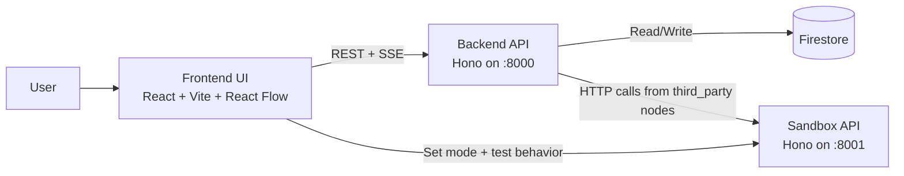
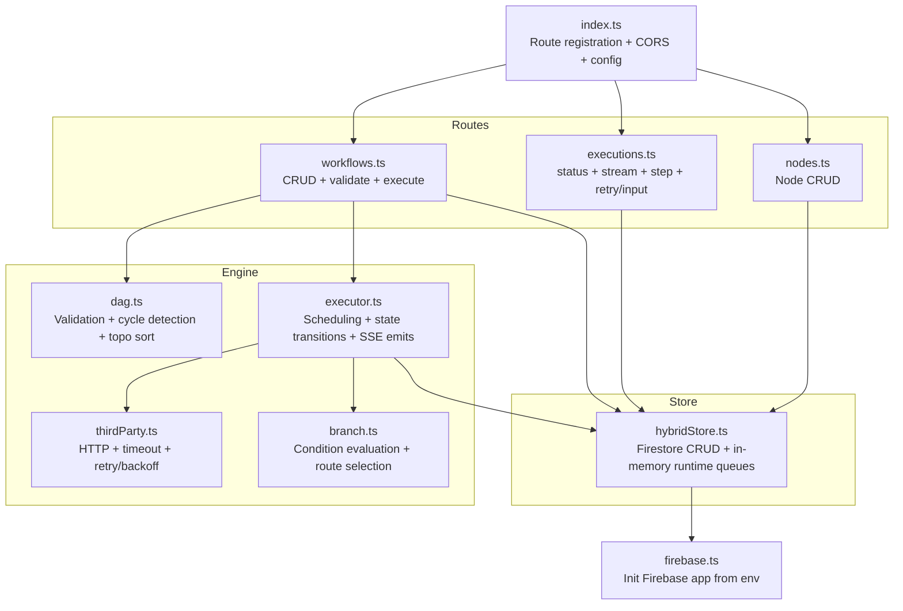
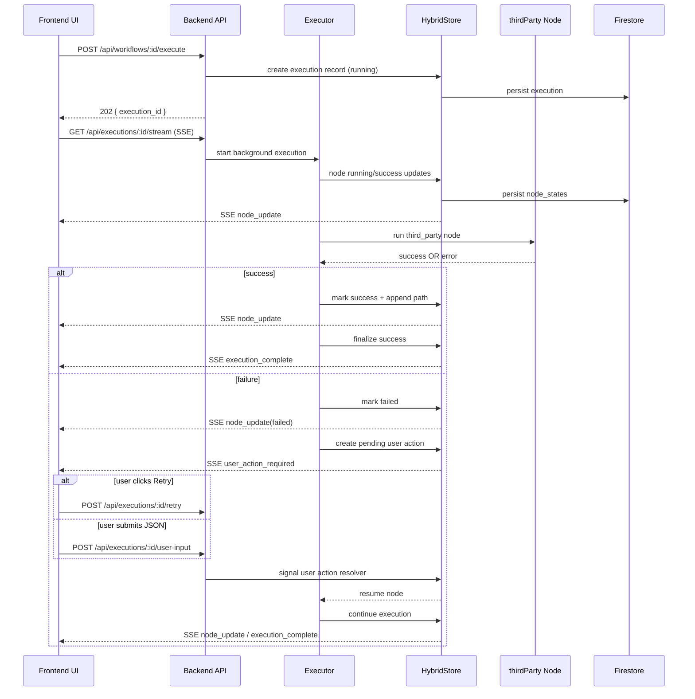

# Architecture Diagrams

## 1) System Context

## 2) Backend Component Architecture

## 3) Execution Sequence (Run + Failure Recovery)

## Notes
- These diagrams match current code organization (`hybridStore.ts`, Hono routes, SSE-driven updates).
- You can paste this file directly into GitHub/Notion that supports Mermaid rendering.
